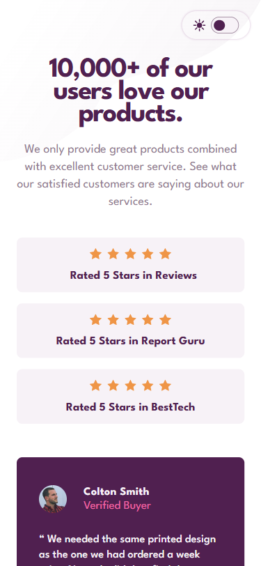

# 💻 Social Proof Section

ADD MORE FLAIR TAGS THAT YOU THINK IS APPLICABLE AND USED IN THIS PROJECT. REMOVE FLAIR TAGS THAT YOU THINK IS NOT APPLICABLE FOR THIS PROJECT.

## ℹ️ A Responsive Social Proof Section for a Design Company

| _Mobile Preview (375x812)_                                   | _Desktop Preview (1440x960)_                                    |
| ------------------------------------------------------------ | --------------------------------------------------------------- |
|       |       |
|  |  |

A polished and responsive social proof section that displays user reviews, star ratings, and a clean layout for a fictional product company.

Created as part of the building challenges from [Frontend Mentor](https://www.frontendmentor.io/).

---

## 🔍 Overview

This project replicates a testimonial layout showcasing user satisfaction for a company's product. It features a structured, mobile-first design that rearranges content responsively for desktop.

It includes three dynamic testimonial cards, three stacked rating banners, background art assets, and a light/dark mode toggle powered by custom CSS variables and JavaScript. Every aspect is coded semantically and built with accessibility in mind.

---

## ✨ Features

- Fully responsive layout (mobile-first)
- Semantic and accessible HTML structure
- Dark/light theme toggle with local storage
- WCAG-friendly color contrast
- CSS custom properties for easy theme management
- Background pattern switching based on theme
- Subtle animations for interactivity
- Google Lighthouse tested and optimized

---

## 🧠 What I Learned

- How to dynamically swap SVG assets based on user theme using vanilla JavaScript
- Using `prefers-color-scheme` and `localStorage` together for UX
- Practicing clean layout structuring with CSS Grid and Flexbox
- Improving hover effects and motion preferences using media queries
- Optimizing color contrast for both themes using custom properties
- Strengthening commitment to semantic HTML and a11y-first practices

---

## 🛠️ Tech Used

- HTML5
- CSS3
- JavaScript (minimal)
- Git
- GitHub
- Netlify

---

## 🎨 Design Reference & Tools

- JPG design image
- PerfectPixel

---

## 🚀 How to Run

1. Clone the repository
2. Open `index.html` in your browser

---

## 🌐 Live Demo

Or you can check out the 👉 [live website here](https://social-proof-section-fm-jiro.netlify.app/)

---

## 📊 Performance Report

A **Google Lighthouse** audit was conducted on the final version of this project. You can view the full report [here](./assets/downloads/lighthouse-performance-report.pdf).

---

## 🧑‍💻 Author

Created by **Elmar Chavez**

🗓️ Month/Year: **July 2025**

📚 Journey: **4th** month of learning _frontend web development_.
